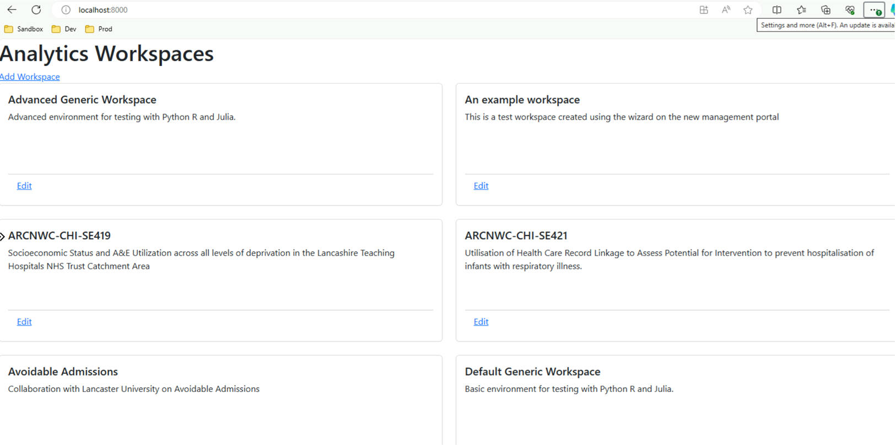
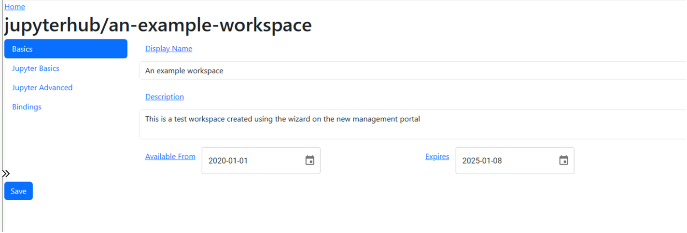
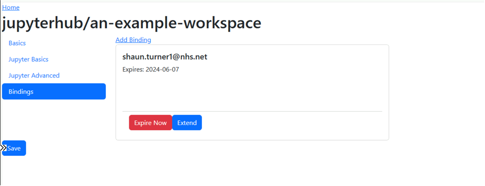

# docker-analytics-workspace-mgmt
The Analytics Workspace Management Portal is designed to simplify the management of Analytics Workspaces in a Kubernetes Jupyterhub environment. It provides a simple user interface to allow the management of workspaces and bindings that allow the mapping of users to a workspace.

With this portal you can:

* List workspaces



* Edit a workspace 


* Manage workspace bindings


# Installing
The analytics workspace management solution is best installed using the official helm chart and details can be found in that repository:

https://github.com/lsc-sde/iac-helm-analytics-workspace-management

# Development
The portal broken down into two parts which are combined together as part of their docker deployment

## Getting Started
Before you get started we recommend reading the [Developers guide](https://lsc-sde.github.io/lsc-sde/Developers.html) to understand the guiding principles of development of the LSCSDE.

When getting started you'll need to [install nodejs and npm](https://docs.npmjs.com/downloading-and-installing-node-js-and-npm)

For windows users:
```powershell
Set-ExecutionPolicy -ExecutionPolicy Unrestricted -Scope Process;
& ./build.ps1;
```

This will do an initial build of the react application and copy the files to the relevant folders. You can then run the components locally.

## Components
### API server 
Using FastAPI and python located in the [root directory](./). This provides the backend API's used to manage permissions.

To run this locally use the following command:
```bash
python -m uvicorn main:app --reload
```

When running locally it should run on [port 8000 on localhost](http://localhost:8000). Any updates to the python file will be automatically reflected when the python file is saved. It should also be noted that when running locally it will use the current kubectl context to talk to the kubernetes cluster so please ensure that the correct context is selected using the command:

```bash
kubectl config use-context <your context>
```

### React Single Page Application (SPA) 
Located in which is in [site/analytics-workspace-mgmt](site/analytics-workspace-mgmt/). These are combined into a single docker image which is supported by the same helm chart that we use to manage the deployment of the CRD’s.

To run this locally use the following command

```bash
npm start
```

This will run on [port 3000 on localhost](http://localhost:3000) and will point at the api server on port 8000. Any updates to the react files should be automatically reflected when the react files are updated.

### Docker
To test building the docker file use the following command

```bash
docker build .
```

### Checking in changes
Once your changes are PR'd to the main branch the pipelines will generate a new docker image and automatically upload these to [dockerhub](https://hub.docker.com/r/lscsde/analytics-workspace-mgmt).

Once the new tag is generated, this will need to be updated in the associated helm chart:
